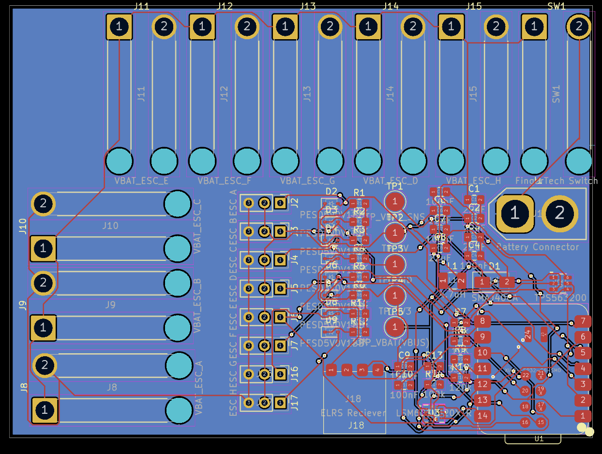

# BeetleBoard

Ever wanted to build a beetleweight but didn't want the huge mess of wires? No? Too bad. Meet BeetleBoard.
A perfect board for controlling your beetleweight battlebot using an ESP32.

## Features:
- 8 ports for ESCs
- 8 motor power ports
- Optional ExpressLRS Receiver
- 6 axis IMU with handling for up to 320Gs
- Software controllable battery undervoltage lockout circuitry
- Battery voltage sensing
- Powered by a XIAO ESP32-C6
- Ability to add a power switch (preferably fingertech)

